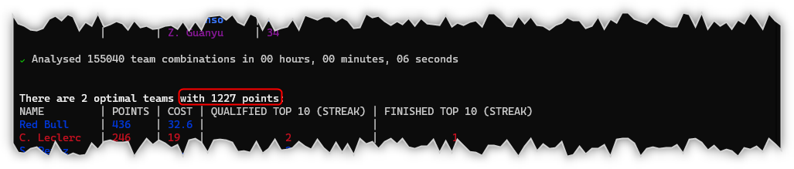

# Change Log

## v1.3.0 - TBC

* Added the number of teams analysed so far to the progress spinner.

---

## v1.2.0 - 5th June 2022

* Added the common points tally when there's two or more optimal teams.

* Updated screenshots to reflect latest output.

---

## v1.1.0 - 4th June 2022

* Improved Fantasy F1 API error handling.
* Added the argument `--year` to override the default season.
* Added the argument `--budget` to override the default budget cap.
* Added the argument `--progressinterval` to change how frequently the screen progress spinner is updated.
* Changed the `progressinterval` to `5` so that the running time is reduced by default.
* Renamed the `Streak` output column headings for greater clarity.

---

## v1.0.1 - 3rd June 2022

* Fixed a couple badge URLs in [README](README.md).

---

## v1.0.0 - 1st June 2022

Initial release.

---
