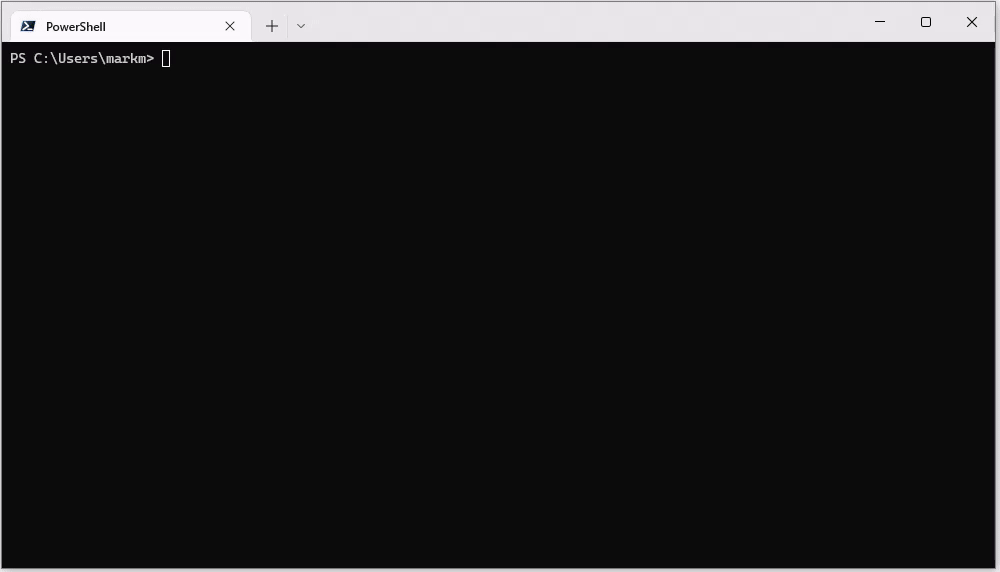

# Fantasy F1 Analyser


[](https://www.codacy.com/gh/markSmurphy/fantasy-f1-analyzer/dashboard?utm_source=github.com&amp;utm_medium=referral&amp;utm_content=markSmurphy/fantasy-f1-analyzer&amp;utm_campaign=Badge_Grade)


A command line utility which retrieves the latest Fantasy F1 results and analyses all possible constructor and driver combinations and suggests an optimum Fantasy F1 Team.


## Overview

I started playing Fantasy F1 for the first time this season (2022) and, like most players, I'd juggle my team around before each race weekend's qualifying session. There were a few obvious front-runners but the rest of my team selection lacked any satisfactory analysis, and instead was borne from drivers I'd like to see do well who fell inside the budget cap restrictions.

So I wrote this tool.

The **Fantasy F1 Analyser** consumes the Fantasy F1 League's public APIs to retrieve the latest driver & constructor standings. It then works through >150,000 permutations of possible Fantasy F1 teams and tallies their score. The team combination(s) with the highest points tally to date (and which falls with the budget cap) are reported back.

If multiple team combinations result the same highest points tally then they are all reported back. The current qualifying and finishing streaks are also reported in case that helps your selection.



### Disclaimer

This tool is not affiliated with the Fantasy F1 League. It is a personal project I've open sourced.
This tool is not a predictor; it uses historical data to retrospectively suggest what would have been a optimal team selection to this point, and is intended for use a baseline for your own team selection.

## Installation

Install globally via `npm` using:

```shell
npm install -g fantasy-f1-analyzer
```

## Usage

Start an analysis via the command:

```shell
ff1
```

## Options

There are a few command line options you can use:

### year

`--year <nnnn>`

Specifies the season's year in case there's a need to override the default.

Default: The current date's four digit year (e.g. `2022`).

### budget

`--budget <nnn>`

Specifies the budget cap in case there's a need to override the default.

Default: `100`.

### Verbose

`--verbose`

Enables verbose output.

Default: `false`

e.g.

```shell
ff1 --verbose
```

### Debug

`--debug`

Enables debugging output.

Default: `false`

e.g.

```shell
ff1 --debug
```

### No-color

`--no-color`

Switches off colour output.

### Version

`--version`

Displays the version number.

### Help

`--help`

Displays the help screen.

## Change Log

The **Change Log** can be found [here](CHANGELOG.md)
